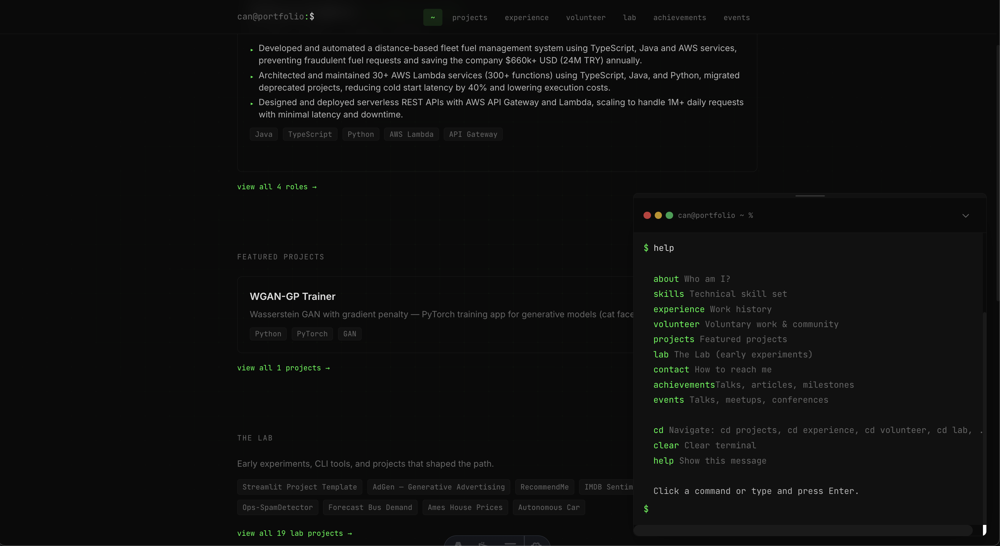
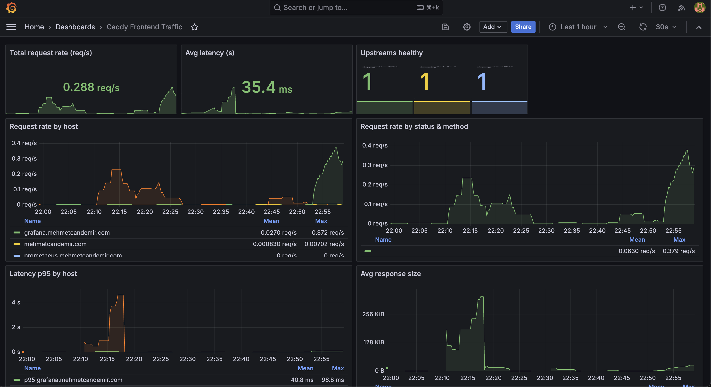

# Portfolio

Personal portfolio site with a terminal-style UI. Built to showcase experience in distributed systems, backend infrastructure, and full-stack development.

**Live:** [mehmetcandemir.com](https://mehmetcandemir.com)



---

## Tech Stack

| Layer | Technologies |
|-------|--------------|
| **Frontend** | Astro, React, TypeScript, Tailwind CSS |
| **Build** | Vite, Sharp (image optimization) |
| **Runtime** | NGINX (static hosting) |
| **Infra** | Docker, Docker Compose |
| **CI/CD** | GitHub Actions (SSH deploy) |
| **Observability** | Prometheus, Grafana |

The site is deployed as a static build served by NGINX in a container, with security headers, gzip compression, and cache policies tuned for performance. Monitoring and dashboards are set up with **Prometheus** for metrics collection and **Grafana** for visualization.



---

## Features

- **Terminal UI** — Interactive CLI-style navigation with commands like `about`, `skills`, `experience`, `projects`, `lab`
- **Content-driven** — MDX for projects, experience, achievements; dynamic README fetching from GitHub
- **View Transitions** — Astro page transitions for smooth navigation
- **Responsive** — Mobile-friendly layout with Tailwind
- **SEO** — Sitemap, Open Graph, canonical URLs

---

## Local Development

```bash
npm install
npm run dev
```

Runs at `http://localhost:4321`.

---

## Production (Docker)

```bash
docker compose up -d --build
```

Requires Caddy (or similar) on `proxy_net` for HTTPS. The frontend is exposed internally only.

---

## Deploy

Push to `master` triggers GitHub Actions → SSH to server → `git pull` + `docker compose up -d --build`.

---

## Scripts

| Command | Description |
|---------|-------------|
| `npm run dev` | Start dev server |
| `npm run build` | Build static site |
| `npm run preview` | Preview production build |
| `npm run optimize:events` | Resize event images to WebP |

---

## License

Personal portfolio.
